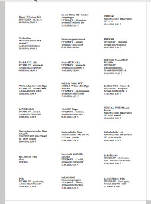

# Csv2LatexLabels

Labels for electronics components.  

From a CSV file with a listing of eletronics components generate a file `names.dat` to be used by the `labels` LaTeX package.


## CSV Input

Format of CSV input:  

| Datum |	Was? |	Wo gekaut? | Wert? | Als Etikett drucken? |
|---|---|---|---|---|
| 21.10.2015 |	Raspberry Pi 2 | XYZ  | 19.10 | 75,99 € | 1 |


## 
The Python program `csv2labelfile.py` generates a `names.dat`. 

Example:  
```
\textbf{Raspi Wireless Kit}
SUSTEREN NL 20.10
\small{22.10.2015, 74,95 €}
```


## Output Example 

An example LaTeX PDF output.  




